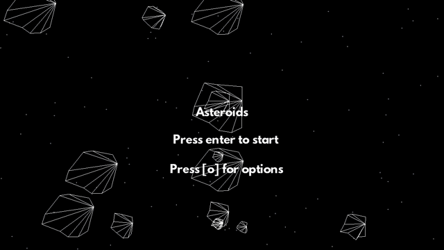

# Dengine
Dengine is a 2d game engine developed with OpenGL and low-level libraries in C. The main goal of Dengine is to facilitate learning from many aspects of Computer Science. Alongside Dengine a game is being built which guides the development of features for the game. Dengine is inspired by Handmade Hero, with a focus on developing as many features with minimal libraries, such that it is not too time-consuming and counter-productive to do so.

## Milestones
Features/research that has been implemented at one point in the making of the engine.

- Asset Management (load data into intermediate formats)
- Audio API from OpenAL
- Basic 2D Game Mathematics/Physics (Vector, Trig, Explicit Euler)
- Collision Detection (Single Axis Theorem, Minkowski Sum/Diff, AABB)
- Debug Services & Displays
- Entity Component Systems
- IMGUI Systems
- Input Parsing
- Push-Buffer Memory Systems
- Small Size Array Optimisations
- Standard Library Replacements (e.g. atoi, strlen, itoa, string)
- Texture Atlas Support, Runtime Font Packing
- OpenGL 2D Rendering Pipeline & Batching Render Calls

## Building
Dengine is currently being developed using Visual Studio 2015. You can build the project by executing the **build.bat** in the src folder, or simply opening the project in Visual Studio and compiling. 

Additionally, an OpenAL-Soft DLL is required which can be downloaded from the Window pre-built binaries of [OpenAL here.](http://kcat.strangesoft.net/openal.html)

NOTE: Assets are not included in the repository. This only excludes audio as game assets are rendered with vertexes.

## Dependencies
- [GLEW](http://glew.sourceforge.net/): Cross platform OpenGL wrapper.
- [GLFW](http://www.glfw.org/): Cross platform OpenGL Application creation.
- [STB](http://www.glfw.org/): Single file utility libraries by Sean Barrett.
- [OpenAL-Soft](https://github.com/kcat/openal-soft): Software implementation of the OpenAL 3D audio API.
